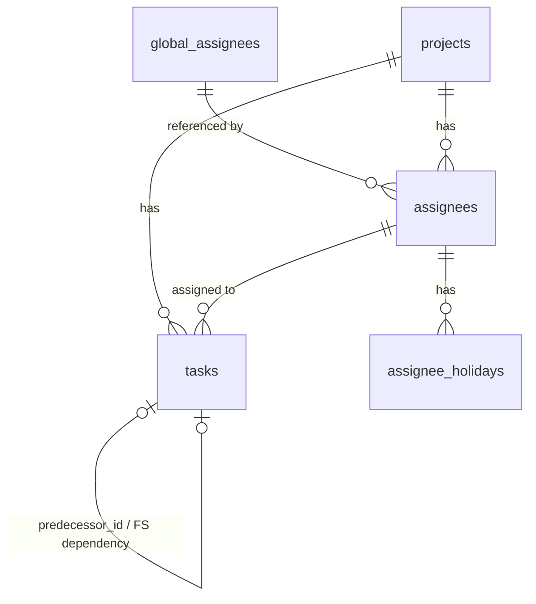

# DB設計書

## 1. 概要

| 項目 | 内容 |
|------|------|
| DBMS | SQLite3 |
| 文字コード | UTF-8 |
| 日付型 | TEXT（ISO 8601形式 `YYYY-MM-DD`）|
| 日時型 | TEXT（ISO 8601形式 `YYYY-MM-DD HH:MM:SS`）|

> SQLiteは外部キー制約がデフォルト無効のため、接続時に必ず `PRAGMA foreign_keys = ON;` を実行すること。

***

## 2. テーブル一覧

| テーブル名 | 説明 |
|------------|------|
| projects | プロジェクト |
| global_assignees | アプリ全体で共有する担当者マスタ |
| assignees | 担当者（プロジェクト内で管理） |
| tasks | タスク（階層構造・依存関係を含む） |
| global_holidays | アプリ全体の休日（祝日等） |
| assignee_holidays | 担当者個人の休日 |

***

## 3. ER図



***

## 4. テーブル定義

### 4.1 projects（プロジェクト）

| カラム名 | 型 | NULL | デフォルト | 説明 |
|----------|----|------|------------|------|
| id | INTEGER | NOT NULL | AUTOINCREMENT | PK |
| name | TEXT | NOT NULL | - | プロジェクト名 |
| start_date | TEXT | NOT NULL | - | 開始日（YYYY-MM-DD） |
| created_at | TEXT | NOT NULL | DATETIME('now') | 作成日時 |
| updated_at | TEXT | NOT NULL | DATETIME('now') | 更新日時 |

---

### 4.2 global_assignees（グローバル担当者マスタ）

| カラム名 | 型 | NULL | デフォルト | 説明 |
|----------|----|------|------------|------|
| id | INTEGER | NOT NULL | AUTOINCREMENT | PK |
| name | TEXT | NOT NULL | - | 担当者名 |

**制約**
- `name` UNIQUE（重複登録を禁止）

---

### 4.3 assignees（担当者）

| カラム名 | 型 | NULL | デフォルト | 説明 |
|----------|----|------|------------|------|
| id | INTEGER | NOT NULL | AUTOINCREMENT | PK |
| project_id | INTEGER | NOT NULL | - | FK → projects.id |
| global_assignee_id | INTEGER | NULL | - | FK → global_assignees.id。NULL = プロジェクト専用 |
| name | TEXT | NOT NULL | - | 担当者名 |
| sort_order | INTEGER | NOT NULL | 0 | 担当者一覧の表示順 |
| created_at | TEXT | NOT NULL | DATETIME('now') | 作成日時 |
| updated_at | TEXT | NOT NULL | DATETIME('now') | 更新日時 |

**制約**
- `project_id` → `projects.id` ON DELETE CASCADE（プロジェクト削除時に担当者も削除）
- `global_assignee_id` → `global_assignees.id` ON DELETE SET NULL（グローバルマスタ削除時は連携解除）

---

### 4.4 tasks（タスク）

| カラム名 | 型 | NULL | デフォルト | 説明 |
|----------|----|------|------------|------|
| id | INTEGER | NOT NULL | AUTOINCREMENT | PK |
| project_id | INTEGER | NOT NULL | - | FK → projects.id |
| parent_id | INTEGER | NULL | - | FK → tasks.id。NULL = ルートタスク |
| predecessor_id | INTEGER | NULL | - | FK → tasks.id。依存タスク（FS）。NULL = 依存なし |
| assignee_id | INTEGER | NULL | - | FK → assignees.id。親タスクは NULL |
| name | TEXT | NOT NULL | - | タスク名 |
| work_days | REAL | NULL | - | 工数（人日）。親タスクは NULL |
| start_date | TEXT | NULL | - | 開始日（YYYY-MM-DD）。親タスクは NULL（後述） |
| end_date | TEXT | NULL | - | 終了日（YYYY-MM-DD）。親タスクは NULL（後述） |
| status | TEXT | NOT NULL | '未着手' | ステータス（後述のCHECK制約参照） |
| progress | INTEGER | NOT NULL | 0 | 進捗率（0〜100） |
| notes | TEXT | NULL | - | 備考 |
| sort_order | INTEGER | NOT NULL | 0 | 同一階層内での表示順 |
| created_at | TEXT | NOT NULL | DATETIME('now') | 作成日時 |
| updated_at | TEXT | NOT NULL | DATETIME('now') | 更新日時 |

**制約**
- `project_id` → `projects.id` ON DELETE CASCADE
- `parent_id` → `tasks.id` ON DELETE CASCADE（親タスク削除時に子タスクも再帰的に削除）
- `predecessor_id` → `tasks.id` ON DELETE SET NULL（依存先タスク削除時は依存関係を解除）
- `assignee_id` → `assignees.id` ON DELETE SET NULL（担当者削除時はNULLに）
- `status` CHECK: `status IN ('未着手', '進行中', '完了', '保留')`
- `progress` CHECK: `progress >= 0 AND progress <= 100`

**親タスクの日付について**

子タスクを持つタスク（親タスク）の `start_date` / `end_date` はDBに保存せず NULL とする。
表示時はアプリケーション側で子タスクの日付から動的に計算する。

| 項目 | 計算ロジック |
|------|-------------|
| 親タスクの開始日 | 直接の子タスクの `start_date` の最小値 |
| 親タスクの終了日 | 直接の子タスクの `end_date` の最大値 |

---

### 4.5 global_holidays（全体休日）

| カラム名 | 型 | NULL | デフォルト | 説明 |
|----------|----|------|------------|------|
| id | INTEGER | NOT NULL | AUTOINCREMENT | PK |
| date | TEXT | NOT NULL | - | 休日の日付（YYYY-MM-DD）|
| name | TEXT | NULL | - | 休日名（例：元日） |

**制約**
- `date` UNIQUE（同じ日付の重複登録を禁止）

> 土曜・日曜はアプリケーションロジックで固定休日として扱い、このテーブルには登録しない。

---

### 4.6 assignee_holidays（担当者個人休日）

| カラム名 | 型 | NULL | デフォルト | 説明 |
|----------|----|------|------------|------|
| id | INTEGER | NOT NULL | AUTOINCREMENT | PK |
| assignee_id | INTEGER | NOT NULL | - | FK → assignees.id |
| date | TEXT | NOT NULL | - | 休日の日付（YYYY-MM-DD） |
| memo | TEXT | NULL | - | メモ（例：有給休暇） |

**制約**
- `assignee_id` → `assignees.id` ON DELETE CASCADE（担当者削除時に個人休日も削除）
- UNIQUE(`assignee_id`, `date`)（同一担当者の同日重複を禁止）

***

## 5. インデックス定義

| インデックス名 | テーブル | カラム | 用途 |
|---------------|----------|--------|------|
| idx_global_assignees_name | global_assignees | name | 名前重複チェック（UNIQUE） |
| idx_tasks_project_id | tasks | project_id | プロジェクト別タスク取得 |
| idx_tasks_parent_id | tasks | parent_id | 子タスク一覧取得 |
| idx_tasks_predecessor_id | tasks | predecessor_id | 後続タスク検索（再計算時） |
| idx_assignees_project_id | assignees | project_id | プロジェクト別担当者取得 |
| idx_assignee_holidays_assignee_id | assignee_holidays | assignee_id | 担当者別休日取得 |

***

## 6. DDL

```sql
PRAGMA foreign_keys = ON;

-- プロジェクト
CREATE TABLE IF NOT EXISTS projects (
    id         INTEGER PRIMARY KEY AUTOINCREMENT,
    name       TEXT    NOT NULL,
    start_date TEXT    NOT NULL,
    created_at TEXT    NOT NULL DEFAULT (DATETIME('now', 'localtime')),
    updated_at TEXT    NOT NULL DEFAULT (DATETIME('now', 'localtime'))
);

-- グローバル担当者マスタ
CREATE TABLE IF NOT EXISTS global_assignees (
    id   INTEGER PRIMARY KEY AUTOINCREMENT,
    name TEXT    NOT NULL UNIQUE
);

-- 担当者
CREATE TABLE IF NOT EXISTS assignees (
    id                 INTEGER PRIMARY KEY AUTOINCREMENT,
    project_id         INTEGER NOT NULL REFERENCES projects(id)         ON DELETE CASCADE,
    global_assignee_id INTEGER          REFERENCES global_assignees(id) ON DELETE SET NULL,
    name               TEXT    NOT NULL,
    sort_order         INTEGER NOT NULL DEFAULT 0,
    created_at         TEXT    NOT NULL DEFAULT (DATETIME('now', 'localtime')),
    updated_at         TEXT    NOT NULL DEFAULT (DATETIME('now', 'localtime'))
);

-- タスク
CREATE TABLE IF NOT EXISTS tasks (
    id             INTEGER PRIMARY KEY AUTOINCREMENT,
    project_id     INTEGER NOT NULL  REFERENCES projects(id)  ON DELETE CASCADE,
    parent_id      INTEGER           REFERENCES tasks(id)     ON DELETE CASCADE,
    predecessor_id INTEGER           REFERENCES tasks(id)     ON DELETE SET NULL,
    assignee_id    INTEGER           REFERENCES assignees(id) ON DELETE SET NULL,
    name           TEXT    NOT NULL,
    work_days      REAL,
    start_date     TEXT,
    end_date       TEXT,
    status         TEXT    NOT NULL DEFAULT '未着手'
                           CHECK (status IN ('未着手', '進行中', '完了', '保留')),
    progress       INTEGER NOT NULL DEFAULT 0
                           CHECK (progress >= 0 AND progress <= 100),
    notes          TEXT,
    sort_order     INTEGER NOT NULL DEFAULT 0,
    created_at     TEXT    NOT NULL DEFAULT (DATETIME('now', 'localtime')),
    updated_at     TEXT    NOT NULL DEFAULT (DATETIME('now', 'localtime'))
);

-- 全体休日
CREATE TABLE IF NOT EXISTS global_holidays (
    id   INTEGER PRIMARY KEY AUTOINCREMENT,
    date TEXT    NOT NULL UNIQUE,
    name TEXT
);

-- 担当者個人休日
CREATE TABLE IF NOT EXISTS assignee_holidays (
    id          INTEGER PRIMARY KEY AUTOINCREMENT,
    assignee_id INTEGER NOT NULL REFERENCES assignees(id) ON DELETE CASCADE,
    date        TEXT    NOT NULL,
    memo        TEXT,
    UNIQUE (assignee_id, date)
);

-- インデックス
CREATE INDEX IF NOT EXISTS idx_tasks_project_id              ON tasks(project_id);
CREATE INDEX IF NOT EXISTS idx_tasks_parent_id               ON tasks(parent_id);
CREATE INDEX IF NOT EXISTS idx_tasks_predecessor_id          ON tasks(predecessor_id);
CREATE INDEX IF NOT EXISTS idx_assignees_project_id          ON assignees(project_id);
CREATE INDEX IF NOT EXISTS idx_assignee_holidays_assignee_id ON assignee_holidays(assignee_id);
```

***

## 7. アプリケーション実装メモ

### updated_at の更新

SQLiteには `ON UPDATE` トリガーがないため、`updated_at` はアプリケーション側（クエリ実行時）で明示的に更新する。

### 再計算の伝播

後続タスクの再計算は以下の手順でアプリケーションが実施する：

1. 変更されたタスクの `predecessor_id` を持つタスクを `idx_tasks_predecessor_id` で検索
2. 該当タスクの `start_date` を「前タスクの `end_date` の翌稼働日」に更新
3. 更新したタスクの `end_date` を「新 `start_date` + `work_days`（稼働日カウント）」で再計算
4. そのタスクを前タスクとして持つタスクに再帰的に同処理を適用

### 稼働日の判定

ある日付が稼働日かどうかの判定順序：

1. 土曜・日曜 → 休日（固定）
2. `global_holidays.date` に存在 → 休日
3. 対象担当者の `assignee_holidays.date` に存在 → 休日
4. それ以外 → 稼働日
