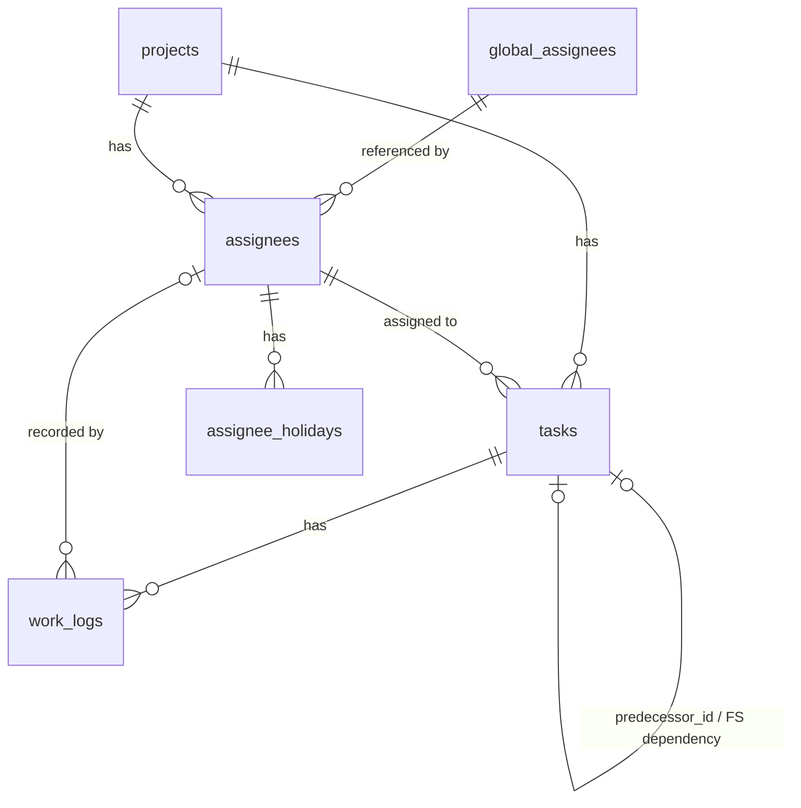

# DB設計

## 概要

| 項目 | 内容 |
|------|------|
| DBMS | SQLite3 |
| 文字コード | UTF-8 |
| 日付型 | TEXT（ISO 8601形式 `YYYY-MM-DD`）|
| 日時型 | TEXT（ISO 8601形式 `YYYY-MM-DD HH:MM:SS`）|

> SQLiteは外部キー制約がデフォルト無効のため、接続時に必ず `PRAGMA foreign_keys = ON;` を実行すること。

## テーブル一覧

| テーブル | 説明 |
|------------|------|
| [projects](projects.md) | プロジェクト |
| [global_assignees](global_assignees.md) | アプリ全体で共有する担当者マスタ |
| [assignees](assignees.md) | 担当者（プロジェクト内で管理） |
| [tasks](tasks.md) | タスク（階層構造・依存関係を含む） |
| [global_holidays](global_holidays.md) | アプリ全体の休日（祝日等） |
| [assignee_holidays](assignee_holidays.md) | 担当者個人の休日 |
| [work_logs](work_logs.md) | タスクへの日々の作業実績 |

## ER図

## アプリケーション実装メモ

### updated_at の更新

SQLiteには `ON UPDATE` トリガーがないため、`updated_at` はアプリケーション側（クエリ実行時）で明示的に更新する。

再計算の伝播は [tasks.md](tasks.md)、稼働日の判定は [../requirements/holiday-settings.md](../requirements/holiday-settings.md) を参照。

## 関連

* 要件: [../requirements/index.md](../requirements/index.md)
* 画面: [../screens/index.md](../screens/index.md)
